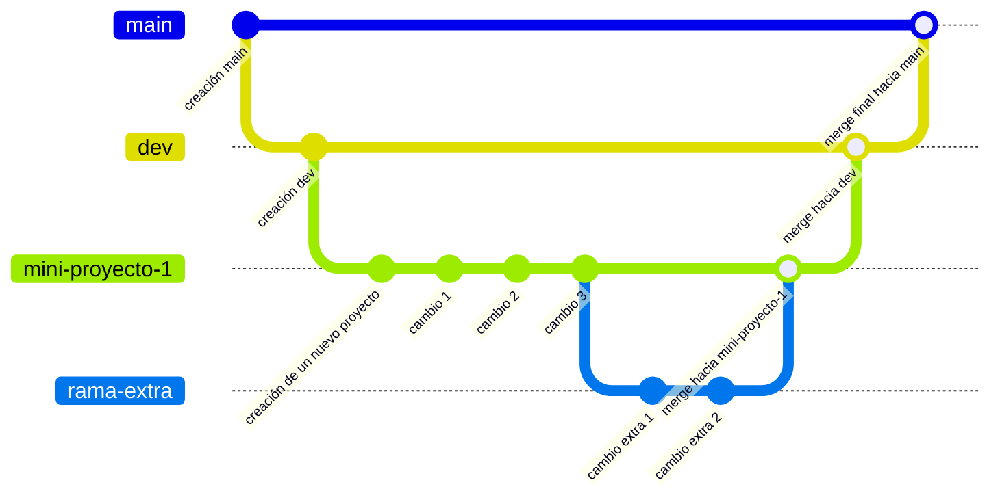

# Diagnóstico

Este repositorio nos servirá para evaluar su conocimiento técnico y habilidad investigativa para resolver los problemas que les presentaré. Primero les explicaré lo que deben hacer, más abajo les dejaré informapción sobre las tecnologías que usaremos.

## Los Proyectos

En este espacio creé cuatro carpetas: aboutMe, estadisticas, dibujo y comentarios. En cada una deberán hacer su proyecto correspondiente:

1. AboutMe: un currículum digital de ustedes o un personaje inventado, la idea es que organicen la información de manera estética y atractiva, incorporando imágenes, videos, etc. Aparte de esto debe contener una lista de enlaces a las redes sociales de la persona, lo que me importa es que sepan hacer redirección, así que no es necesario que sea links a redes sociales reales, pueden ser links a páginas que existan pero que seas genéricas, como youtube, google, etc.

2. estaditicas: deben mostrar gráficos estadísticos simples sobre el set de datos que dejé dentro de la misma carpeta. Pueden ser gráficos de barras, de torta, de dispersión, etc. Lo que me importa es que logren leerlos y traducirlos a gráficos.

3. dibujo: una grilla simple del tamaño que estimen conveniente pintada inicialmente de blanco, en donde, al pasar el cursor por encima de una casilla, esta se pinte de negro y, al salir de la casilla, mantenga ese color, salvo que se vuelva a pasar el cursor por encima, en ese caso se despintará (volverá a ser blanca).

4. comentarios: una sección de comentarios en donde se muestre un pequeño formulario donde se deba ingresar un nombre y un texto, hacer click en un botón "enviar" y que el comentario se agregue justo debajo, a una lista ordenada de ellos. No es necesario que los comentarios sean persistentes, es decir, pueden ser eliminados al recargar la página.

Todos estos proyectos deben ser programados usando React + Vite y estilizados usando Tailwind CSS, es por eso que tendrán que inicializar en cada carpeta un nuevo proyecto de React con Vite y configurarlo para usar Tailwind CSS. Tendrán que buscar en internet como hacerlo.

Primero deben que crear una rama para cada proyecto y dentro de ella inicializarlo en su carpeta correspondiente.

Tienen total libertad para repartirse o desarrollar en conjunto los proyectos, lo único que deben hacer por separado es la inicialización de cada uno (cada persona debe inicializar un proyecto en una rama distinta). Me fijaré que cumplan con eso ya que en GitHub quedan registrados todos los cambios que hace cada uno.

### Consideraciones

- Les recomiendo que una sola persona programe en una sola rama para evitar conflictos. Esto no significa que no puedan trabajar en conjunto, de hecho, pueden hacer "pair programming", es decir, uno programa mientras el otro ve lo que está haciendo y da sugerencias o discuten sobre cómo abordar el problema.

- Tienen total libertad para usar inteligencia artificial, lo que me importa es que entiendan lo que están haciendo. Es por eso que organizaremos una reunión final para que me expliquen lo que hicieron.

- Pueden instalar todas las librerías que quieran, mientras sepan qué cosa hace cada una.

## Sobre Git

Lo primero que necesitan para empezar a programar es conocer Git, esta es una herramienta fundamental que nos servirá para llevar un mayor control sobre los cambios en el código. Deben instalarlo desde [git-scm.com](https://git-scm.com/) y configurarlo con su cuenta de GitHub, buscar en internet y aprender cómo configurar su cuenta será la primera de sus tareas.

Lo conveniente de trabajar con Git es que podremos trabajar con ramas. Como analogía, el repositorio sería un multiverso donde cada rama es un universo paralelo con su propia línea temporal donde los eventos (cambios en el código) se desarrollan de manera independiente, estos universos pueden chocar entre sí y fusionarse en uno solo si así lo deseamos.

Dado que las ramas son paralelas, mientras no se fusionen, los cambios en una no afectarán a las otras, es decir, si están trabajando en su propia rama pueden despreocuparse de romperle el código a los demás desarrolladores.

### Dinámica

Solo cuando tengan la configuración lista podrán clonar el repositorio con el comando (en su consola):

```bash
git clone https://github.com/PreuIngUC/DeveloperDiagnosis.git
```

El flujo de trabajo será el siguiente:

- Deben ubicarse en la rama dev, el comando que usaremos para movernos a una rama específica es: `git switch <nombre-de-la-rama>`.
- Desde ahí deben crear una nueva rama con el comando: `git switch -c <nombre-de-la-rama>`. Agregar el flag `-c` crea la nueva rama y, dado que usamos `switch`, el comando nos desplaza a esta automáticamente.
- Dentro de la nueva rama creada tienen total libertad de programar y experimentar. Cuando quieran subir sus cambios deben ejecutar los siguientes comandos:

```bash
git add .
git commit -m "<mensaje>"
git push origin <nombre-de-la-rama>
```

- El primer comando agrega todos los cambios realizados a Git (en local), el segundo indica que queremos crear un commit (una "instantánea" de los cambios) con un mensaje que describa lo que se hizo (sean muy descriptivos con los cambios que hayan realizado) y, finalmente, el tercer comando envía los cambios a GitHub. Les recomiendo hacer commit cada vez que sientan que han avanzado en algo importante.
- Cuando hayan terminado el mini-proyecto deben volver a GitHub y, en las pestañas de arriba, en "Pull requests", hacer click en "New pull request" para abrir una solicitud de fusión, ahí deben elegir la rama de destino, en este caso "dev", y la rama de origen, en este caso su rama personalizada. Una vez enviada la solicitud un administrador podrá revisarla y decidir si será fusionada.
- Dentro de sus propias ramas pueden crear más ramas para experimentar y usarlas como lo encuentren conveniente. Para fusionarlas deben seguir el mismo flujo que en el punto anterior, en ese caso no es necesario que un administrador les apruebe la fusión, pueden aprobarla ustedes mismos ya que solo se encuentrar protegidas las ramas "dev" y "main".



## Sobre NodeJS

Antes de usar React + Vite deben instalar NodeJS, este nos permite corren código JavaScript en el computador. Pueden descargarlo desde [nodejs.org](https://nodejs.org/)

## Sobre React + Vite

React es una librería de JavaScript que permite crear interfaces de usuario. Vite es un entorno de desarrollo que nos permite crear proyectos de React de manera rápida y sencilla.

Tendrán que invesitgar por su cuenta cómo inicializar un proyecto y configurarlo para usar Tailwind CSS.

Algunos links útiles son:

- [React](https://es.react.dev/)
- [Vite](https://vitejs.dev/)
- [Tailwind CSS](https://tailwindcss.com/)
